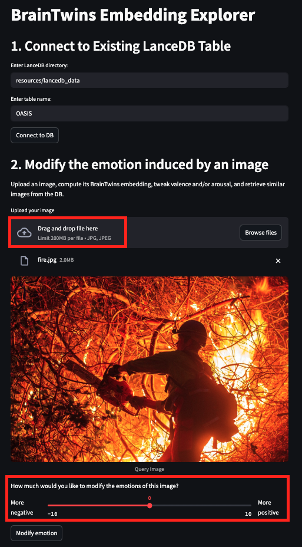

[](https://brainvivodev.github.io/openbrain-brainvivo/)
[](https://github.com/BrainVivoDev/OpenBrain/blob/main/LICENSE.txt)

[](https://twitter.com/Brainvivo)
[](https://discord.gg/QfX4PS79)

# Open-Brain
Open-Brain is trained on functional MRI data to predict the neural activation patterns that images elicit across 1,024 distinct brain regions. These predicted responses serve as image embeddings, sensitively encoding the emotional reactions each image evokes within a specific cohort. For more information please refer to the [project page](https://brainvivodev.github.io/openbrain-brainvivo/).


# Use-cases

- Emotion-Based Image Clustering: Cluster images according to the emotional responses they elicit (see the t‑SNE example in `open_brain_examples.ipynb`).

- Emotional Transformation: Modify an image’s emotional tone by adjusting activations in specific brain regions (see the *BrainTwins Embedding Explorer* below).

- Video and Image Characterization: Evaluate media content by analyzing the emotions it provokes (see the Perceptor tool below).


# BrainTwins Embedding Explorer

The BrainTwins Embedding Explorer app allows you to freely explore how images map onto brain embeddings. To get started, choose a LanceDB table (the default uses the OASIS dataset, as shown in the first screenshot, although creating a new LanceDB is available via script, see below). Next, upload an image and transform the emotion portrayed in the image by using the emotions slider, then click the “Modify Emotion” button. This transforms the brain embedding accordingly and displays five images from the OASIS dataset that share the most similar brain embedding (see second screenshot). Finally, delve deeper into the brain response by viewing which regions are most responsive and learning about their cognitive roles in perception (see third screenshot). These results can also be downloaded as a CSV file for further analysis.

<table>
  <tr>
    <td></td>
    <td></td>
    <td></td>
  </tr>
</table>

You can use the online tool [here](https://embedding-explorer.brainvivo.com) or install the library (see instructions below) and then execute:
```{shell}
streamlit run ./brainTwins_embedding_explorer/app.py
```

# Perceptor

Perceptor analyzes media (videos and images) content using a brain response prediction model (one which is adapted for continuous stimuli). The tool helps content creators understand potential audience reactions through quantitative metrics.

Features:

- Emotional Analysis: Temporal breakdown of emotional responses (sadness, happiness, etc.)

- Valence-Arousal Data: Plots showing emotional intensity and sentiment changes

- Perception Score: Numerical evaluation of content-persona alignment

- Brain Region Mapping: Visualization of activated brain regions

- LLM Integration: Text-based interface for content improvement questions

- Cognitive Dimension Analysis: Multi-factor evaluation of memory, attention, and decision-making responses

You can use the online tool [here](https://demo.brainvivo.com/)


# Installation

1. Clone this repository

2. Create a virtual environment and install packages

```{python}
python3.10 -m venv .openbrain
source .openbrain/bin/activate
pip install -r requirements.txt
```

3. (Optional) Download the OASIS image dataset dataset  
This step is optional (the OASIS dataset is required for the BrainTwins Embedding Explorer tool, although using a different image set is enabled, see *Using your own set of images* section below).

    1. Download [OASIS](https://www.benedekkurdi.com/#oasis)

    2. Set the environment variable

```{shell}
export DB_IMAGE_DIR=<images folder path>
```
For example: `export DB_IMAGE_DIR=./oasis/Images`

Please note: the OASIS dataset contains highly graphic imagery. Viewer discretion is advised.

# Usage:
The repository includes two models. One predicts the brain response using Meta's Imagebind as image embedding and the other from Open CLIP image embedding. Both models are hosted on Huggingface. 

## Download the models from Huggingface
```{shell}
cd brain_embedding_model
python download_models_from_Huggingface.py
```

## Test
```{shell}
python test_tensors.py
```

# Getting started (Imagebind)
```{python}
from image_embedding_model.imagebind_embedding import calc_imagebind_embedding
from brain_embedding_model.brain_embedding import calc_brain_embedding

BRAIN_EMBEDDING_MAT = "./brain_embedding_model/imagebind_embedding_model.safetensors"
OASIS_IMAGE_DIR = <YOUR IMAGE FOLDER PATH>

image_emb = calc_imagebind_embedding(OASIS_IMAGE_DIR)
data = calc_brain_embedding(
        image_emb, brain_model_file=BRAIN_EMBEDDING_MAT
)
```

# Getting started (Open CLIP)
```{python}
from image_embedding_model.openclip_embedding import calc_openclip_embedding
from brain_embedding_model.brain_embedding import calc_brain_embedding

BRAIN_EMBEDDING_MAT = "./brain_embedding_model/openclip_embedding_model.safetensors"
OASIS_IMAGE_DIR = <YOUR IMAGE FOLDER PATH>

image_emb = calc_openclip_embedding(OASIS_IMAGE_DIR)
data = calc_brain_embedding(
        image_emb, brain_model_file=BRAIN_EMBEDDING_MAT
)
```
# Using your own set of images (with the BrainTwins Embedding Explorer)
Instead of using the provided OASIS database, you can create a new lancedb table based on a set of images of your choice, and explore how your images map onto brain embeddings space.

To do so, first build the lancedb table using
```{shell}
python ./brainTwins_embedding_explorer/create_images_db.py <path to your images folder> <new db name>
```
For example `python ./brainTwins_embedding_explorer/create_images_db.py ~/Downloads/project_images my_new_db`

Please note that the provided folder should include at least 256 images.

After this new db is done, to use it, make sure to re-run `export DB_IMAGE_DIR=<images folder path>` with the new folder containing the relevant images

Then, when running the app with 
```{shell}
streamlit run ./brainTwins_embedding_explorer/app.py
```
Please write the name of your new db under *"Enter table name"* before clicking *Connect to DB*


# Examples notebook

In this notebook we chatacterize the brain embedding. More information can be found on the Project page.

[Notebook](./open_brain_examples.ipynb)


# Feedback
You may use the "Issues" tab or Open-Brain's [Discord](https://discord.gg/QfX4PS79) channel. 

# License

Apache License 2.0 with Commons Clause

# References

Kurdi, B., Lozano, S., & Banaji, M. R. (2017). Introducing the Open Affective Standardized Image Set (OASIS). Behavior Research Methods, 49(2), 457–470. 

Ilharco, G., Wortsman, M., Wightman, R., Gordon, C., Carlini, N., Taori, R., Dave, A., Shankar, V., Namkoong, H., Miller, J., Hajishirzi, H., Farhadi, A., & Schmidt, L. (2021, July). OpenCLIP (Software)

Girdhar, R., El-Nouby, A., Liu, Z., Singh, M., Alwala, K. V., Joulin, A., & Misra, I. (2023). Imagebind: One embedding space to bind them all. In Proceedings of the IEEE/CVF conference on computer vision and pattern recognition.


